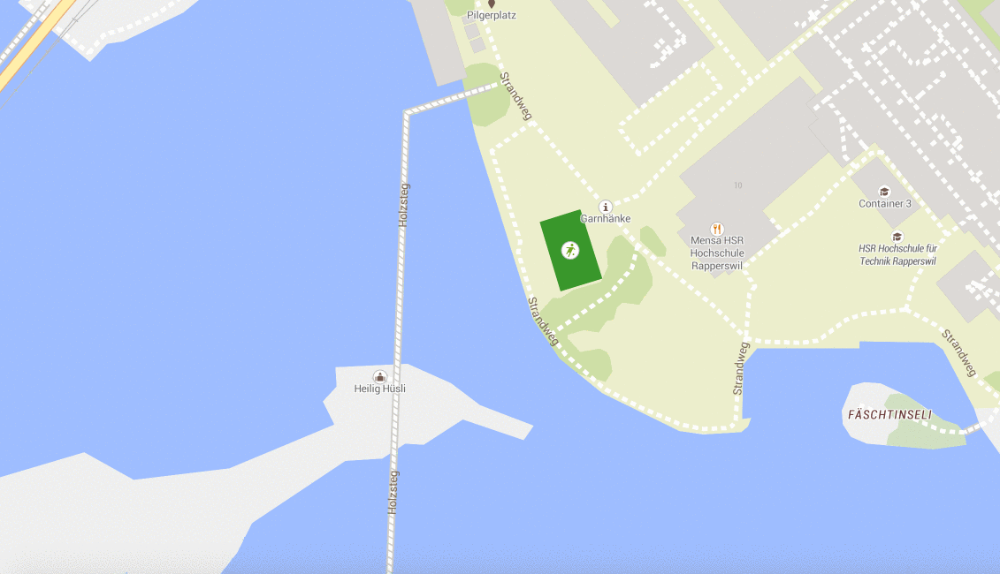

# Chamemo

Meet together to move and stay healthy. Using the Doodle API and Firebase we enable local
people to meet and do sports together at public sport areas.



## Develop

**Chamemo** is written in ES6 and is using [React](https://github.com/facebook/react), [Immutable.js](https://facebook.github.io/immutable-js/) and [Mapbox GL JS](https://www.mapbox.com/mapbox-gl-js/api/) for the map.

Install the deps, start the dev server and open the web browser on `http://localhost:8888/`.

```bash
# install dependencies
npm install
# start dev server
npm start
```

Build a production package for distribution.

```
npm run build
```

Lint the JavaScript code.

```
# install lint dependencies
npm install --save-dev eslint eslint-plugin-react
# run linter
npm run lint
```
